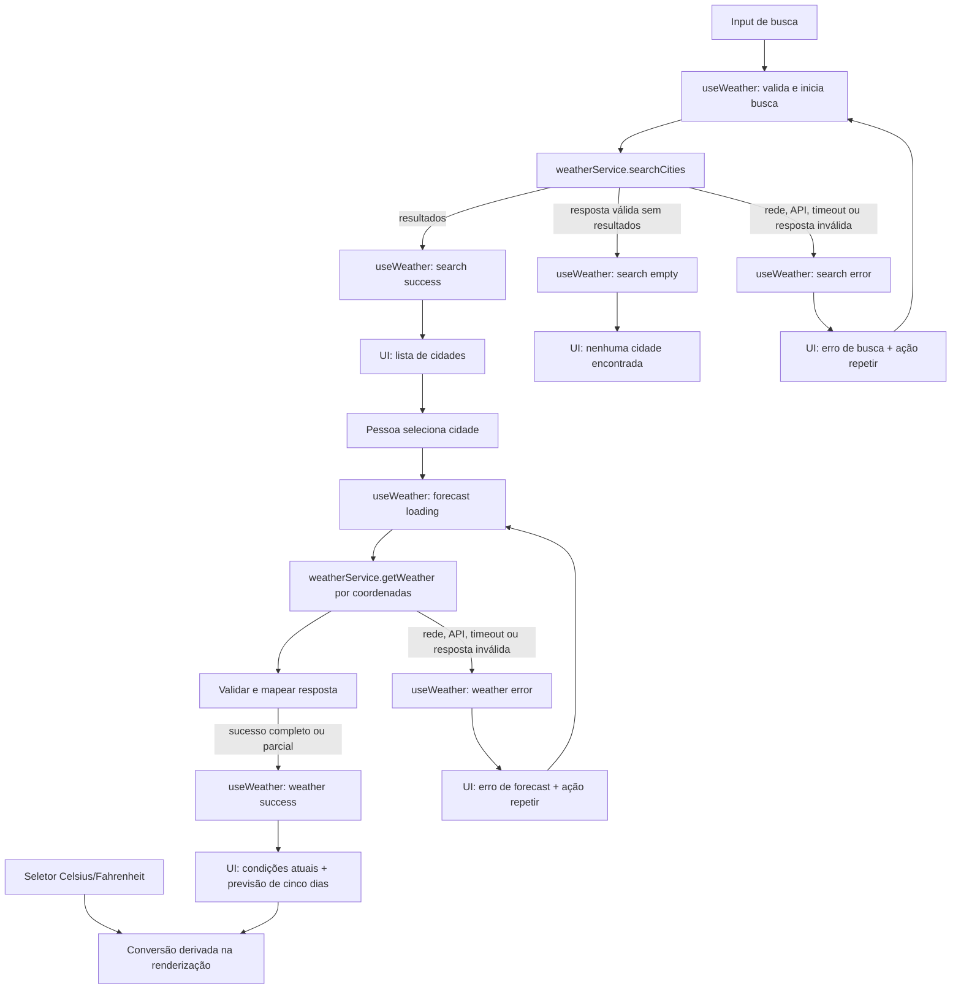

# Plano Técnico — Weather App

Este plano deriva de [specs/weather-app-spec.md](../specs/weather-app-spec.md). As decisões de produto confirmadas na spec são tratadas como baseline; metas identificadas como propostas e as questões Q-01 a Q-05 continuam sujeitas a aprovação antes de serem compromissos de implementação.

## Architecture

Aplicação web SPA em camadas, com fluxo unidirecional e sem biblioteca adicional de estado:

- **Apresentação (`src/components/`)**: busca, seleção explícita de localidade, condições atuais, previsão diária, seletor de unidade e estados acessíveis de carregamento, vazio, erro e dados incompletos.
- **Orquestração (`src/hooks/`)**: hook `useWeather` coordena busca, seleção, carregamento de clima, repetição e unidade ativa.
- **Acesso a dados (`src/services/`)**: cliente Open-Meteo isolado, validação das respostas e conversão do formato externo para o modelo da aplicação.
- **Funções puras (`src/lib/`)**: conversão de temperatura, mapeamento de códigos meteorológicos e formatação de data/hora.
- **Contratos (`src/types/`)**: tipos compartilhados entre hook, serviço e componentes.

Busca e clima são operações separadas: a resposta da busca apresenta opções; somente a seleção explícita de uma opção define a localidade ativa e inicia a consulta meteorológica. Não haverá seleção automática de resultado, geolocalização, persistência ou modo offline na v1.

Rastreabilidade principal: FR-01 / AC-01.1–AC-01.6; FR-02 / AC-02.1–AC-02.6; FR-03 / AC-03.1–AC-03.5; FR-04 / AC-04.1–AC-04.5.

## Tech Stack

| Camada | Tecnologia | Decisão |
| --- | --- | --- |
| Linguagem | TypeScript strict | Contratos explícitos para respostas externas que podem ter campos ausentes. |
| UI | React + Vite | SPA responsiva, alinhada à estrutura e ao ambiente do projeto. |
| Estilo | Tailwind CSS | Usar a configuração visual já existente no projeto. |
| Testes unitários | Vitest + Testing Library | Testar funções puras, serviço e estados/componentes. |
| Testes E2E | Playwright | Cobrir fluxos reais e viewports definidos na spec. |
| Dados | Open-Meteo Geocoding e Forecast | Fonte sem chave de API, sujeita à validação de cobertura, termos, atribuição e limites (Q-02). |

Não adicionar biblioteca de gerenciamento de estado, cliente HTTP ou cache para este escopo. Usar `fetch` e APIs nativas do navegador.

## Project Structure

```text
src/
├── components/
│   ├── SearchBar.tsx
│   ├── CityResults.tsx
│   ├── CurrentWeather.tsx
│   ├── ForecastList.tsx
│   ├── ForecastDay.tsx
│   ├── UnitToggle.tsx
│   └── WeatherStatus.tsx
├── hooks/
│   └── useWeather.ts
├── services/
│   └── weatherService.ts
├── lib/
│   ├── temperature.ts
│   ├── weatherCodes.ts
│   └── dateTime.ts
├── types/
│   └── weather.ts
└── App.tsx
tests/
├── unit/       # funções, serviço e componentes conforme convenção do projeto
└── e2e/        # fluxos Playwright
```

Os nomes são contratos de responsabilidade, não exigência de criar cada arquivo isoladamente. Reutilizar a organização de testes já existente caso ela difira do exemplo.

## Data Model

Os modelos internos usam Celsius como unidade canônica. `undefined` representa campo não fornecido ou inválido; nunca converter ausência em zero. Campos obrigatórios para apresentação permanecem representáveis como ausentes para que o estado incompleto previsto na spec possa ser distinguido de sucesso completo.

```ts
// Unidade de temperatura selecionada para apresentação.
export type Unit = 'celsius' | 'fahrenheit';

export interface City {
  id: number; // Identificador do resultado de geocodificação.
  name: string; // Nome da cidade retornado pelo geocodificador.
  country: string; // País da localidade.
  admin1?: string; // Região administrativa, quando fornecida.
  latitude: number; // Latitude usada na consulta meteorológica.
  longitude: number; // Longitude usada na consulta meteorológica.
}

export interface CurrentWeather {
  temperatureC?: number; // temperature_2m em Celsius.
  weatherCode?: number; // weather_code atual da Open-Meteo.
  referenceTime?: string; // time da observação, no fuso da cidade.
  apparentTemperatureC?: number; // apparent_temperature em Celsius.
  relativeHumidity?: number; // relative_humidity_2m em porcentagem.
  windSpeedKmh?: number; // wind_speed_10m em km/h.
  precipitationMm?: number; // precipitation acumulada em milímetros.
  pressureHpa?: number; // surface_pressure em hPa, não pressão ao nível do mar.
}

export interface ForecastDay {
  date: string; // time diário YYYY-MM-DD no fuso da cidade.
  weatherCode?: number; // weather_code diário.
  minimumC?: number; // temperature_2m_min em Celsius.
  maximumC?: number; // temperature_2m_max em Celsius.
  precipitationProbability?: number; // precipitation_probability_max em porcentagem.
}

export interface WeatherData {
  city: City; // Localidade explicitamente selecionada.
  timezone: string; // Fuso horário retornado para a localidade.
  current: CurrentWeather; // Observações meteorológicas atuais disponíveis.
  forecast: ForecastDay[]; // Cinco dias locais consecutivos, de hoje até hoje + 4.
}
```

`City.id` corresponde ao identificador do resultado do geocodificador. Valores meteorológicos continuam vinculados às coordenadas selecionadas. A condição visível é derivada de `weatherCode` por um mapeamento pt-BR; código desconhecido resulta em “Condição indisponível”. Temperaturas são arredondadas ao inteiro mais próximo somente na apresentação.

## Data Flow



A consulta preserva acentos, apóstrofos e hífens, removendo espaços somente nas extremidades. Uma seleção inicia geocoding-independent weather lookup pelas coordenadas daquele resultado. Respostas atrasadas de consultas anteriores não podem sobrescrever a busca ou cidade ativas; cancelar requisições anteriores com `AbortController` quando possível e validar também a identidade da operação antes de atualizar estado.

## External APIs

### Geocoding

**URL:** `https://geocoding-api.open-meteo.com/v1/search`

Exemplo de chamada: `GET /v1/search?name=São%20Paulo&count=10&language=pt&format=json`.

| Parâmetro | Uso |
| --- | --- |
| `name` | Consulta digitada, codificada como query string; remover somente espaços das extremidades. |
| `count=10` | Limita a quantidade de localidades candidatas. |
| `language=pt` | Solicita nomes/localizações em português quando disponíveis. |
| `format=json` | Solicita resposta JSON. |

Resposta resumida (valores ilustrativos):

```json
{
  "results": [
    {
      "id": 3448439,
      "name": "São Paulo",
      "latitude": -23.5475,
      "longitude": -46.63611,
      "country": "Brasil",
      "admin1": "São Paulo"
    }
  ]
}
```

Mapeamento: cada `results[]` vira um `City`: `id`, `name`, `country`, `admin1` (opcional), `latitude` e `longitude`. A aplicação apresenta contexto geográfico e exige seleção explícita. Uma resposta válida sem `results` ou com lista vazia significa “nenhuma cidade encontrada”; falhas HTTP/rede, timeout ou JSON inválido são erros distintos.

### Forecast

**URL:** `https://api.open-meteo.com/v1/forecast`

Exemplo resumido de chamada:

```text
GET /v1/forecast?latitude=-23.5475&longitude=-46.63611
  &current=temperature_2m,apparent_temperature,relative_humidity_2m,wind_speed_10m,precipitation,surface_pressure,weather_code
  &daily=weather_code,temperature_2m_min,temperature_2m_max,precipitation_probability_max
  &temperature_unit=celsius&wind_speed_unit=kmh&precipitation_unit=mm
  &forecast_days=5&timezone=auto
```

Parâmetros relevantes:

- `latitude` e `longitude` da cidade selecionada;
- `current=temperature_2m,apparent_temperature,relative_humidity_2m,wind_speed_10m,precipitation,surface_pressure,weather_code`;
- `daily=weather_code,temperature_2m_min,temperature_2m_max,precipitation_probability_max`;
- `temperature_unit=celsius`, `wind_speed_unit=kmh`, `precipitation_unit=mm`;
- `forecast_days=5`, `timezone=auto`.

Resposta resumida (valores ilustrativos):

```json
{
  "latitude": -23.55,
  "longitude": -46.63,
  "timezone": "America/Sao_Paulo",
  "current_units": { "temperature_2m": "°C", "wind_speed_10m": "km/h" },
  "current": {
    "time": "2026-10-07T14:00",
    "temperature_2m": 22.4,
    "apparent_temperature": 23.1,
    "relative_humidity_2m": 61,
    "wind_speed_10m": 12.6,
    "precipitation": 0.0,
    "surface_pressure": 925.3,
    "weather_code": 2
  },
  "daily_units": { "temperature_2m_min": "°C", "precipitation_probability_max": "%" },
  "daily": {
    "time": ["2026-10-07", "2026-10-08", "2026-10-09", "2026-10-10", "2026-10-11"],
    "weather_code": [2, 3, 61, 2, 1],
    "temperature_2m_min": [16.2, 17.0, 18.1, 16.8, 17.3],
    "temperature_2m_max": [25.4, 26.1, 23.8, 25.0, 26.4],
    "precipitation_probability_max": [10, 20, 60, 15, 5]
  }
}
```

Mapeamento para o modelo:

- `current.temperature_2m` → `CurrentWeather.temperatureC`; `weather_code` → `weatherCode`; `time` → `referenceTime`; `apparent_temperature` → `apparentTemperatureC`; `relative_humidity_2m` → `relativeHumidity`; `wind_speed_10m` → `windSpeedKmh`; `precipitation` → `precipitationMm`; `surface_pressure` → `pressureHpa` (pressão atmosférica local em hPa).
- `timezone` → `WeatherData.timezone`; objeto `current` mapeado → `WeatherData.current`; cidade selecionada na busca → `WeatherData.city` (não inferir cidade a partir das coordenadas arredondadas da resposta forecast).
- Para cada índice `i` dos arrays em `daily`, criar um `ForecastDay`: `time[i]` → `date`, `weather_code[i]` → `weatherCode`, `temperature_2m_min[i]` → `minimumC`, `temperature_2m_max[i]` → `maximumC` e `precipitation_probability_max[i]` → `precipitationProbability`.
- Produzir cinco posições cronológicas sem deslocar valores para cobrir lacunas. Campo ausente ou inválido permanece ausente no tipo correspondente; arrays diários são associados por índice/data e validados antes de formar a lista.

O contrato dos parâmetros deverá ser conferido com a documentação vigente e com os gates Q-02/Q-05 antes da implementação.

Todas as requisições externas usam HTTPS e timeout máximo de 10 segundos (proposta NFR-05). Não incluir dados além do nome de cidade na busca; informar à pessoa que essa consulta é enviada ao Open-Meteo (NFR-08).

## State Management

O estado da funcionalidade vive em um único hook `useWeather`, instanciado por `App`, sem store global nem persistência. O hook mantém a consulta e os resultados de busca, a cidade selecionada, o estado meteorológico e a unidade da sessão. Componentes recebem os dados e ações necessários por props; estado puramente visual e transitório pode permanecer no componente que o utiliza.

Busca e clima têm estados independentes. `empty` aplica-se somente à busca bem-sucedida sem cidades; não é erro. A consulta meteorológica sem campos obrigatórios ou parcialmente preenchida continua como `success` com `completeness: 'partial'`, permitindo mostrar datas e campos indisponíveis sem inventar valores.

Contratos de estado sugeridos:

```ts
type WeatherError =
  | { kind: 'network' }
  | { kind: 'api'; status?: number; code?: string }
  | { kind: 'timeout' }
  | { kind: 'invalid-response' };

type SearchState =
  | { status: 'idle' }
  | { status: 'loading'; query: string }
  | { status: 'success'; query: string; cities: City[] }
  | { status: 'empty'; query: string }
  | { status: 'error'; query: string; error: WeatherError };

type WeatherState =
  | { status: 'idle' }
  | { status: 'loading'; city: City }
  | { status: 'success'; data: WeatherData; completeness: 'complete' | 'partial' }
  | { status: 'error'; city: City; error: WeatherError };
```

`Unit` inicia como `celsius` em cada sessão, sem `localStorage`. O serviço sempre solicita e armazena temperaturas em Celsius. Na renderização, uma função pura recebe cada temperatura Celsius presente e a unidade ativa: para Fahrenheit calcula `C * 9 / 5 + 32`; arredonda ao inteiro mais próximo somente ao formatar o valor visível. Para Celsius, apresenta o valor armazenado com o arredondamento de apresentação. Campo ausente continua indisponível e nunca é convertido. Essa derivação atualiza valores atuais e previstos sem alterar cidade, outros campos ou disparar uma nova requisição.

Repetir uma falha meteorológica consulta novamente a cidade ativa; repetir busca mantém a consulta digitada. Respostas de operações antigas não podem substituir o estado da busca ou cidade selecionada.

## Error Handling

- **Validação e vazio:** não enviar consulta vazia; mostrar validação junto ao campo. Resposta de geocoding válida sem resultados vira `empty`, mantém a consulta e não reutiliza cidades anteriores (AC-01.4, AC-01.5).
- **Rede:** falha de conexão é erro `network`, distinto de nenhum resultado. Encerrar carregamento, preservar consulta/cidade ativa e oferecer repetição manual.
- **API/provedor:** HTTP não bem-sucedido, limite de requisições ou erro reportado pelo provedor vira erro `api`; manter a mensagem distinta de `empty` e não apresentar previsão anterior como atual (AC-01.6, AC-03.4).
- **Timeout:** cada requisição termina em até 10 s conforme a proposta NFR-05. Classificar o timeout como `timeout`, encerrar carregamento e permitir repetição explícita; não tratar todo cancelamento como timeout (cancelamento por nova busca é esperado).
- **Resposta inválida:** JSON inválido, formato incompatível ou dados essenciais impossíveis de mapear viram `invalid-response`, com mensagem de indisponibilidade e opção de tentar novamente.
- **Resposta parcial:** campos opcionais ausentes são exibidos como “Indisponível”. Se faltar temperatura, condição ou horário atual, marcar o painel como incompleto e não afirmar atualidade (AC-02.3). Manter as cinco datas da previsão; se condição ou mínima/máxima estiver ausente, marcar aquela posição como “Previsão indisponível” (AC-03.3). Não substituir ausências por zero, inferência ou valor de outra cidade.
- **Frescor e fuso:** dados com mais de 3 h, sem horário de referência ou sem fuso não são rotulados como atuais; informar desatualização/indisponibilidade conforme NFR-09. Formatar horário no fuso da cidade.
- **Condição meteorológica:** mapear códigos conhecidos para rótulos pt-BR; código desconhecido resulta em “Condição indisponível” sem invalidar outros campos válidos.
- **Concorrência:** cancelar requisições obsoletas quando possível e verificar a identidade da operação antes de atualizar estado, para uma resposta atrasada não substituir a cidade atual.
- **Acessibilidade:** estados e mensagens são semânticos, operáveis por teclado e anunciados a tecnologias assistivas conforme NFR-03.

## Testing Strategy

### Vitest

- **Funções puras:** conversão Celsius/Fahrenheit, arredondamento somente na apresentação, valores negativos e ausência de valor; formatação de datas/horas no fuso da cidade; mapeamento de códigos meteorológicos conhecidos e desconhecidos.
- **Services com `fetch` mockado:** URL e parâmetros de geocoding/forecast; mapeamento para os modelos; resultados vazios; campos ausentes e arrays diários incompletos; HTTP não bem-sucedido/limite do provedor; JSON/formato inválido; falha de rede e timeout.
- **Componentes e hook:** busca nos estados `loading`, `error`, `empty` e `success`; seleção explícita; clima em `loading`, `error`, `success` completo e parcial; repetição; cinco posições da previsão mesmo com lacunas; alternância de unidade sem novo request; resposta atrasada sem sobrescrever cidade atual. Incluir operação por teclado, foco e anúncios acessíveis dos estados essenciais.

### Playwright

- Fluxo E2E principal: digitar cidade → escolher resultado correto entre localidades → consultar condições atuais e cinco dias → alternar Celsius/Fahrenheit e confirmar atualização sem nova chamada meteorológica.
- Fluxos de nenhum resultado, falha/timeout e repetição; trocar de cidade durante carregamento para verificar que resposta obsoleta não substitui a seleção vigente. Interceptar APIs com respostas determinísticas.
- Cobrir viewports mobile de 320 px e 375 px, incluindo retrato e paisagem, e executar verificações responsivas adicionais nos breakpoints especificados (768, 1024 e 1440 px). Validar famílias de navegadores e critérios WCAG conforme aprovação das metas NFR-01, NFR-03 e NFR-07.

Metas operacionais de p95 e disponibilidade (NFR-04/NFR-06) exigem monitoramento/medição no ambiente e janela especificados pela spec; não são demonstradas apenas pelos testes unitários ou E2E.

## Risks & Trade-offs

| Risco/decisão | Consequência | Mitigação ou trade-off |
| --- | --- | --- |
| Decisão | Trade-off e alternativa considerada |
| --- | --- |
| Open-Meteo sem chave de API | Evita segredo e reduz configuração no cliente; cobertura, termos, limites e disponibilidade dependem do provedor. Alternativa: outro provedor meteorológico, possivelmente com chave, custo ou backend proxy; validar Q-02 antes de produção. |
| Estado local em `useWeather` | Um hook atende o fluxo único sem dependência adicional, mas concentra a orquestração. Alternativas: Context para compartilhamento amplo ou Redux/Zustand para múltiplas áreas/fluxos concorrentes; não justificadas no escopo atual. |
| `fetch` nativo nos services | Mantém dependências e abstrações reduzidas, com tratamento explícito de timeout e erros. Alternativas: Axios para interceptors/configuração HTTP ou TanStack Query para cache, deduplicação e retries; essas capacidades não são necessárias para a política de repetição manual da v1. |
| Celsius como unidade canônica e conversão na apresentação | Evita duplicar dados e mantém a troca de unidade sem request; exige testar fórmula e arredondamento. Alternativa: solicitar Fahrenheit ao provedor ou persistir ambas as unidades, aumentando chamadas/estado e risco de divergência. |
| Sem cache, persistência ou modo offline | Evita apresentar observação antiga como atual e mantém a política de privacidade simples; consultas dependem de conexão e nova sessão começa sem cidade. Alternativa: cache local com timestamp e aviso de desatualização, fora do escopo da v1. |
| Busca manual e seleção explícita | Evita permissão de localização e escolha equivocada de homônimos; adiciona um passo à consulta. Alternativa: geolocalização automática com consentimento e fallback para busca, fora do escopo aprovado. |
| Fuso `auto` da Open-Meteo e datas diárias retornadas | Alinha a previsão ao dia local da cidade; depende de resposta de fuso válida e requer testes de virada de dia. Alternativa: UTC ou fuso do dispositivo, ambos podem exibir datas diferentes da localidade consultada. |
| Metas NFR propostas e personas não validadas | Metas de desempenho, disponibilidade, compatibilidade e acessibilidade precisam de aceite e validação; não devem ser tratadas como compromisso antes disso. Alternativa: aprovar ou substituir os alvos e prioridades pelos gates Q-01 a Q-05. |
| Resultados homônimos e dados parciais | Podem levar a localidade errada ou interpretação incompleta. Mitigar com contexto geográfico, seleção explícita, campos indisponíveis e limite de frescor proposto de 3 h; validar Q-05. |
